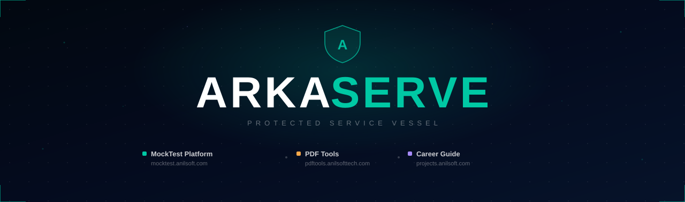

  

 

  
  &nbsp;
  
  &nbsp;
  

 

> *Building focused digital products that serve real needs — independent, purposeful, and iterative.*

---

## ⚡ Our Products

<table>
  <tr>
    <td align="center" width="33%">
       
      
        
      <b>MockTest Platform</b>
       
      Exam preparation for banking, SSC &amp; govt exams
        
      🎯 10,000+ questions
       
      IBPS &nbsp;·&nbsp; SBI &nbsp;·&nbsp; RRB &nbsp;·&nbsp; SSC &nbsp;·&nbsp; POSTAL
        
      
    </td>
    <td align="center" width="33%">
       
      
        
      <b>PDF Tools</b>
       
      57+ document processing services
        
      📄 Merge &nbsp;·&nbsp; Split &nbsp;·&nbsp; Compress
       
      OCR &nbsp;·&nbsp; Sign &nbsp;·&nbsp; Watermark &nbsp;·&nbsp; +45 more
        
      
    </td>
    <td align="center" width="33%">
       
      
        
      <b>Career Guide</b>
       
      Resources for final-year students
        
      🎓 Project Ideas &nbsp;·&nbsp; Resume Prep
       
      API Test Guides &nbsp;·&nbsp; Company Insights
        
      
    </td>
  </tr>
</table>

---

## 🛠️ Built With

---

## 📊 GitHub Stats

  
  &nbsp;
  

  

---

## 📬 Get in Touch

Have a question, collaboration idea, or just want to say hello?

**[→ arkaserve.in/#contact](https://arkaserve.in/#contact)** &nbsp;·&nbsp; **[anil.mikkili@gmail.com](mailto:anil.mikkili@gmail.com)**

---

  © 2026 Arkaserve &nbsp;·&nbsp; Three products. One unified mission.

